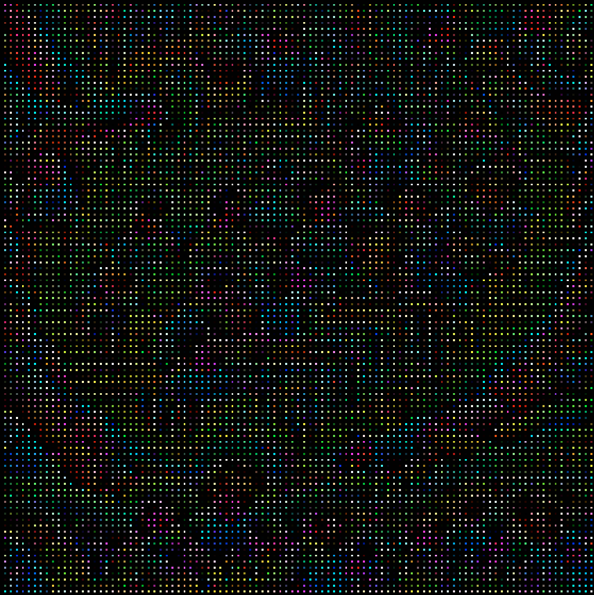

# *Developing Patch Based Adversarial Attacks*
## Ian McDiarmid-Sterling
##### Swarthmore College
##### 14 August, 2020

This repository allows one to generate, evaluate, and visualize a patch based adversarial attack for the Yolov3 object detector, a copy of which is included in this repository. Some of the code in this repository has been pulled directly from other repositories, as cited in my research report.

This is the code associated with my research, generated with funding from Swarthmore College's SOAR-NSE undergraduate research program, and with assistance from Profesor Allan Moser.


**Badges will go here**

- build status
- issues (waffle.io maybe)
- devDependencies
- npm package
- coverage
- slack
- downloads
- gitter chat
- license
- etc.


***INSERT ANOTHER GRAPHIC HERE***


- Most people will glance at your `README`, *maybe* star it, and leave
- Ergo, people should understand instantly what your project is about based on your repo

> Tips


- HAVE WHITE SPACE
- MAKE IT PRETTY
- GIFS ARE REALLY COOL

> GIF Tools

- Use <a href="http://recordit.co/" target="_blank">**Recordit**</a> to create quicks screencasts of your desktop and export them as `GIF`s.
- For terminal sessions, there's <a href="https://github.com/chjj/ttystudio" target="_blank">**ttystudio**</a> which also supports exporting `GIF`s.

**Recordit**


**ttystudio**


---

## Table of Contents (Optional)

> If your `README` has a lot of info, section headers might be nice.

- [Installation](#installation)
- [Features](#features)
- [Contributing](#contributing)
- [Team](#team)
- [FAQ](#faq)
- [Support](#support)
- [License](#license)


---

## Example (Optional)

```javascript
// code away!

let generateProject = project => {
  let code = [];
  for (let js = 0; js < project.length; js++) {
    code.push(js);
  }
};
```

---

## Installation


## Requirements

Python 3.7 or later with all `requirements.txt` dependencies installed. To install all dependencies run:
```bash
$ pip install -U -r requirements.txt
```


- All the `code` required to get started
- Images of what it should look like

## Training
- Set the main logic command in the config.gin to 'train'
```bash
python adversarial_attack.py config.gin
```


## Visualization
- Set the main logic command in the config.gin to 'visualize'
```bash
python adversarial_attack.py config.gin
```


## Evaluation
- Set the main logic command in the config.gin to 'evaluate'
- Set the secondary logic command if desired
```bash
python adversarial_attack.py config.gin
```
## Hyper Parameter Optimization
- Set the main logic command in the config.gin to 'optimize'
- Set the optimization parameters in the config.gin
```bash
python adversarial_attack.py config.gin
```
  


### Setup

- If you want more syntax highlighting, format your code like this:

> update and install this package first

```shell
$ brew update
$ brew install fvcproductions
```

> now install npm and bower packages

```shell
$ npm install
$ bower install
```

- For all the possible languages that support syntax highlithing on GitHub (which is basically all of them), refer <a href="https://github.com/github/linguist/blob/master/lib/linguist/languages.yml" target="_blank">here</a>.

---

## Features
## Usage (Optional)
## Documentation (Optional)
## Tests (Optional)

- Going into more detail on code and technologies used
- I utilized this nifty <a href="https://github.com/adam-p/markdown-here/wiki/Markdown-Cheatsheet" target="_blank">Markdown Cheatsheet</a> for this sample `README`.

---

## Contributing

> To get started...

### Step 1

- **Option 1**
    - 🍴 Fork this repo!

- **Option 2**
    - 👯 Clone this repo to your local machine using `https://github.com/joanaz/HireDot2.git`

### Step 2

- **HACK AWAY!** 🔨🔨🔨

### Step 3

- 🔃 Create a new pull request using <a href="https://github.com/joanaz/HireDot2/compare/" target="_blank">`https://github.com/joanaz/HireDot2/compare/`</a>.

---

## Team

> Or Contributors/People

| <a href="http://fvcproductions.com" target="_blank">**FVCproductions**</a> | <a href="http://fvcproductions.com" target="_blank">**FVCproductions**</a> | <a href="http://fvcproductions.com" target="_blank">**FVCproductions**</a> |
| :---: |:---:| :---:|
| [](http://fvcproductions.com)    | [](http://fvcproductions.com) | [](http://fvcproductions.com)  |
| <a href="http://github.com/fvcproductions" target="_blank">`github.com/fvcproductions`</a> | <a href="http://github.com/fvcproductions" target="_blank">`github.com/fvcproductions`</a> | <a href="http://github.com/fvcproductions" target="_blank">`github.com/fvcproductions`</a> |

- You can just grab their GitHub profile image URL
- You should probably resize their picture using `?s=200` at the end of the image URL.

---

## FAQ

- **How do I do *specifically* so and so?**
    - No problem! Just do this.

---

## Questions?
Feel free to email me at ianmcdiarmidsterling at gmail dot com


---

## License

[](http://badges.mit-license.org)

- **[MIT license](http://opensource.org/licenses/mit-license.php)**

